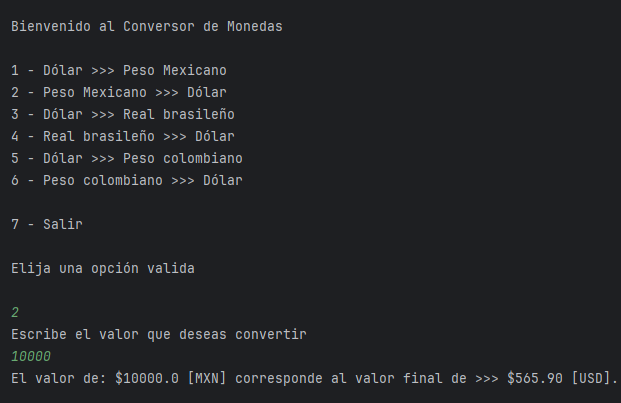

# Conversor de Moneda - Challenge ONE - Java - Back end


## Feature

- Desarrollar un Conversor de Monedas con interacción textual (vía consola) utilizando Java. 
- Realizar solicitudes a una API de tasas de cambio, manipular datos JSON y filtrar las monedas de interés.

##### Pasos para completar el proyecto:

- Configuración del Ambiente Java: Prepara tu entorno de desarrollo.
- Creación del Proyecto: Inicia un nuevo proyecto en tu IDE.
- Consumo de la API: Realiza solicitudes a la API de tasas de cambio.
- Análisis de la Respuesta JSON: Maneja y extrae datos de la respuesta JSON.
- Filtro de Monedas: Selecciona las monedas que te interesan.
- Exhibición de Resultados: Muestra los resultados a los usuarios.
## Tech Stack

- [Java JDK: versión 11 en adelante](https://www.oracle.com/br/java/technologies/downloads/)
- [Biblioteca Gson 2.10.1 en adelante](https://mvnrepository.com/artifact/com.google.code.gson/gson/2.10.1)
- [Postman](https://www.postman.com/downloads/)
- [IDE (Entorno de Desarrollo Integrado) IntelliJ IDEA](https://www.jetbrains.com/es-es/idea/download/?section=windows)
- [Exchange Rate API](https://www.exchangerate-api.com/)
## Code Review

- Empleamos la clase `HttpClient` para realizar solicitudes a la API de tasas de cambio y obtener datos esenciales.

```java
HttpClient client = HttpClient.newHttpClient();
```

- La clase `HttpRequest` en Java nos brinda un control detallado sobre los parámetros de nuestras solicitudes, lo que resulta esencial para adaptar la consulta a nuestras necesidades específicas.

```java
HttpRequest request = HttpRequest.newBuilder()
                .uri(URI.create(String.valueOf(url)))
                .build();
```

- La interfaz `HttpResponse` en Java ofrece una estructura que permite acceder y analizar los diferentes elementos de una respuesta HTTP, que normalmente se presenta en formato JSON.

```java
HttpResponse<String> response;

        try {
            response = client
                    .send(request, HttpResponse.BodyHandlers.ofString());
        } catch (IOException | InterruptedException e) {
            throw new RuntimeException(e);
        }

        String json = response.body();

        return json;
```

- Para el filtrado de monedas, será necesario utilizar el atributo "Currency Code" del JSON.

```java
switch (opcionUsuario) {
                    case 1:
                        monedaBase = "USD";
                        monedaDestino = "MXN";
                        break;
                    case 2:
                        monedaBase = "MXN";
                        monedaDestino = "USD";
                        break;
                    case 3:
                        monedaBase = "USD";
                        monedaDestino = "BRL";
                        break;
                    case 4:
                        monedaBase = "BRL";
                        monedaDestino = "USD";
                        break;
                    case 5:
                        monedaBase = "USD";
                        monedaDestino = "COP";
                        break;
                    case 6:
                        monedaBase = "COP";
                        monedaDestino = "USD";
                        break;
                }
```

- En esta etapa , nos adentraremos en la interacción con el usuario, implementando una interfaz textual a través de la consola que presenta opciones de conversión de monedas.

```java
var menu = """
                    
                    Bienvenido al Conversor de Monedas
                    
                    1 - Dólar >>> Peso Mexicano
                    2 - Peso Mexicano >>> Dólar
                    3 - Dólar >>> Real brasileño
                    4 - Real brasileño >>> Dólar
                    5 - Dólar >>> Peso colombiano
                    6 - Peso colombiano >>> Dólar
                    
                    7 - Salir
                    
                    Elija una opción valida
                    """;

                System.out.println(menu);
                var opcionUsuario = teclado.nextInt();

                System.out.println("Escribe el valor que deseas convertir");
                var montoUsuario = teclado.nextDouble();

                URI direccion = URI.create(urlBase + apiKey + urlRespuesta + monedaBase + "/" + monedaDestino + "/" + montoUsuario);

                String json = consumoApi.obtenerDatos(direccion);

                var conversion = conversor.convierteDatos(json);

                BigDecimal resultado = BigDecimal.valueOf(montoUsuario * conversion.conversion_rate());

                System.out.println("El valor de: $" + montoUsuario + " ["
                        + monedaBase + "] corresponde al valor final de >>> $"
                        + resultado.setScale(2, RoundingMode.HALF_UP) + " [" + monedaDestino + "].");
```


## Screenshots




## Run Locally

Clone the project

```bash
  git clone https://github.com/EliAbdiel/Conversor-de-Moneda-Challenge-ONE-Java-Back-end.git
```

Go to the project directory

```bash
  cd Conversor-de-Moneda-Challenge-ONE-Java-Back-end
```


## Authors

- [Elí Abdiel Chan López](https://www.github.com/EliAbdiel)


## License

Este proyecto está bajo la licencia [MIT](https://choosealicense.com/licenses/mit/)

Este proyecto está bajo la licencia [GPLv3 License](https://opensource.org/licenses/)

